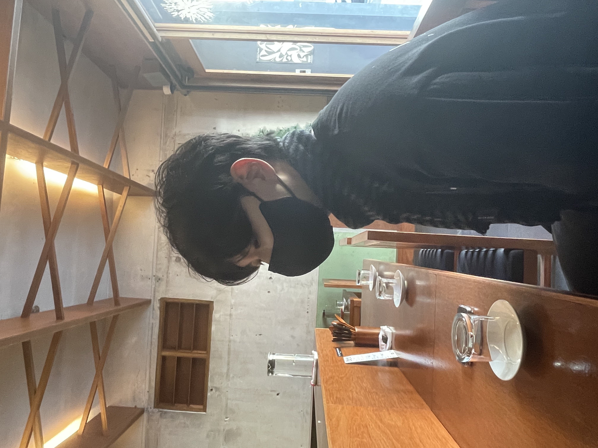
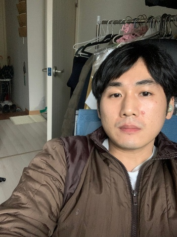

# 🤼‍♂️ React Pair Programming Study

페어프로그래밍을 통한 리액트 학습

 
 

## 📝 스터디 방법

1. 각 팀별로 구현사항과 규칙을 정한다.
2. 정해진 시간에 모여 지정한 주제를 기반으로 페어프로그래밍을 활용하여 구현한다.

 
 

### 🧑‍✈️ 페어프로그래밍 규칙 예시

1. 네비게이터와 드라이버가 존재한다.
2. 각 역할을 10 ~ 15분이 지나면 역할을 바꾼다.
3. 틀린 결과값은 존재하여도 틀린 행동은 없으니 행동에 대한 비난이나 지적은 하지 않는다.
4. 너무 세세한 네비게이팅을 하지 않는다.

 
 

### 브랜치 규칙

main을 제외하고 페어프로그래밍 주제를 []대괄호 안에 작성하고 팀원 이름을 작성한다.

#### ex)

`- main`  
`ㄴ [TicTacToe] nara, seungmin`  
`ㄴ [TicTacToe] junyoung, dayoung` ...

 
 

# 🧑‍💻 스터디원

|                              팀원                              |                              팀원                              |                              팀원                              |                              팀원                               |                              팀원                               |                              팀원                               |     |
| :------------------------------------------------------------: | :------------------------------------------------------------: | :------------------------------------------------------------: | :-------------------------------------------------------------: | :-------------------------------------------------------------: | :-------------------------------------------------------------: | :-: |
|  |  |  |  |  |  |     |
|         [☕️ 나라](https://velog.io/@nara04040/posts)          |           [🐿️ 다영](https://iamwooda0.tistory.com/)            |          [🐰 성민](https://velog.io/@seongmin/posts)           |            [🏋️ 준영](https://www.physicaljun.blog/)             |            [🤖 희원](https://velog.io/@phwon7/posts)            |            [🐶 준위](https://velog.io/@pletze/posts)            |     |

 

 
 

### 참고사이트

- [페어프로그래밍 참고 블로그](https://velog.io/@congaweb/Pair-Programing)
