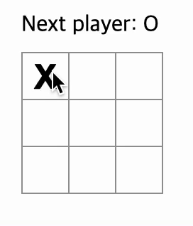

## 구현목표

- Tic-Tac-Toe게임을 지금까지 배운 리액트를 기반으로 구현을 통해 리액트에 대한 이해와 코드 스킬의 발전을 기대합니다.

 

### 구현예시

 

 
 

### 참고사이트

- [리액트 공식문서 틱택토 게임](https://ko.react.dev/learn/tutorial-tic-tac-toe)
- [페어프로그래밍 참고 블로그](https://velog.io/@congaweb/Pair-Programing)
- [live share 소개](https://usage.tistory.com/164)

 

## 구현사항 예시

- [ ] 빈 사각형 9개가 (3 \* 3) 존재한다.
- [ ] 빈 사각형을 클릭하면 “O” 나 “X”가 표시된다.
  - [ ] 한 번 클릭한 표시는 변할 수 없다.
  - [ ] 처음 클릭은 “X”가 표시된다.
- [ ] 클릭을 하여 “O” 또는 “X” 가 표시되었다면 그 다음 표시는 무조건 다른 모양이 표시된다.
  - [ ] Next Player를 보여주며 다음 표시를 알려준다. (ex: Next Player: X)
- [ ] 승리조건을 충족한다면 게임을 멈추고 승리자를 보여준다.
  - [ ] 승리조건은 가로, 세로, 대각선을 포함하여 3개가 연속적으로 존재한다면 승리조건에 만족한다. (ex: Next player ⇒ Winner player로 변경)
  - [ ] 승리자가 정해지면 더 이상 클릭 불가

 
 

## 참고사항

- 코드를 받은 후 `npm install` 을 통해 필요한 package를 다운받는다.
- 실행결과를 보고싶다면 `npm run dev` 를 통해 볼 수 있다.
